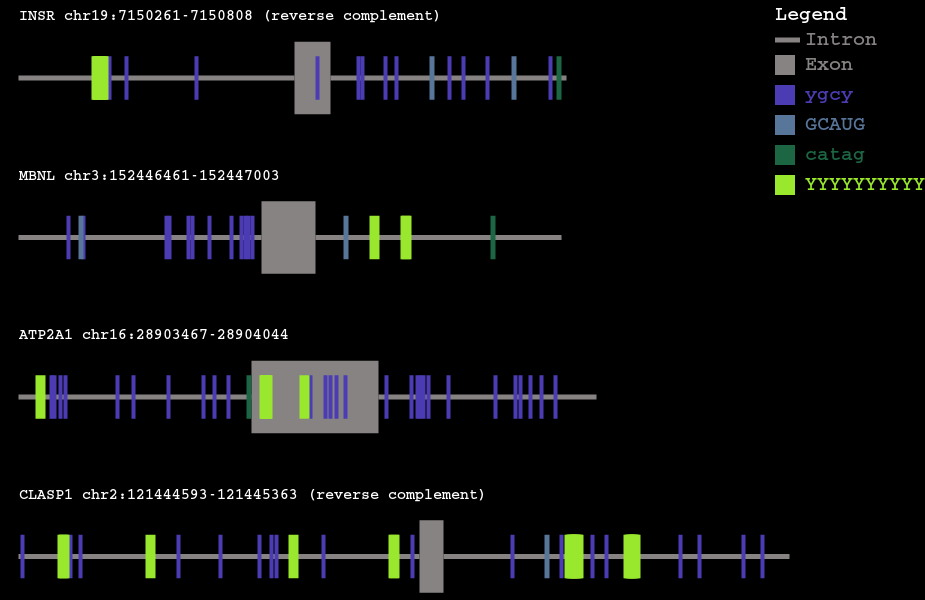

# Motif marker
__________________________________________________________________________________________
This script was created in order to provide a tool that would enable the visualization of motifs within gene sequences. Given an input fasta file, and a reference file containing motifs to search for, the script will produce a scaled image containing the locations of the motifs provided.  

## Usage 
To use this script, execute:  
```motif-mark-oop.py``` 
with the following arguments:
-f --fasta file: input fasta file containing either RNA and/or DNA sequence reads. The script identifies exons based on character captilization.  
-m --motifs file: file containing motifs to search for within each gene. Motif file should contain 1 motif per line and can handle any combination of pyrimadines and/or purines (i.e 'r' and 'y' are acceptable characters for purine and pyrimidine searching, respectively).

See example input motif file labled ```Fig_1_motifs.txt``` and fasta file labeled ```Figure_1.fasta``` for reference. 

See ```Figure_1.png``` below for an example of the output of the script. 


